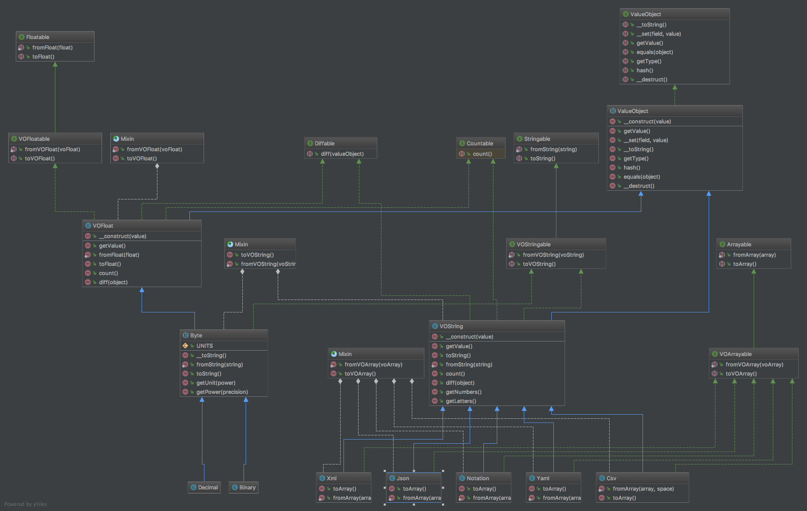

[Back](../../README.md)

# Format

```php
BestServedCold\PhalueObjects\Format
```

## UML



## Classes

### Byte

```php
BestServedCold\PhalueObjects\Format\Byte\Binary
BestServedCold\PhalueObjects\Format\Byte\Decimal
```

Usage:

```php
var_dump(Binary::fromString('100 MB')->getValue());
var_dump(Decimal::fromString('100 MB')->getValue());
var_dump(Binary::fromFloat(123456)->toString());
var_dump((string) Binary::fromFloat(1.208925819614629e24)); 
```

Outputs:

```shell
double(104857600)
double(100000000)
string(16) "120.56 Kilobytes"
string(11) "1 Yottabyte"
```

### Csv
```php
BestServedCold\PhalueObjects\Format\Csv
```

### Json
```php
BestServedcold\PhalueObjects\Format\Json
```

### Xml
```php
BestServedCold\PhalueObjects\Format\Xml
```

### Yaml
```php 
BestServedCold\PhalueObjects\Format\Yaml
```
